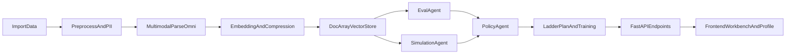

# 茧评 LLM 全量落地实施计划

## 目标与范围
- 目标：将当前“LLM骨架”升级为“报告同款可运行链路”，覆盖本地/远程推理、多模态理解、协同智能体、破茧策略生成、行为模拟、LoRA微调、跨平台采集与认知训练闭环。
- 约束：你选择了“先接远程推理 API，再补本地”与“按开题报告全量落地”。
- 基线代码：
  - 推理与路由层：[d:\OneDrive\Desktop\大三下\breaker\src\llm\gateway.py](d:\OneDrive\Desktop\大三下\breaker\src\llm\gateway.py)、[d:\OneDrive\Desktop\大三下\breaker\src\llm\providers\local_provider.py](d:\OneDrive\Desktop\大三下\breaker\src\llm\providers\local_provider.py)、[d:\OneDrive\Desktop\大三下\breaker\src\llm\providers\dashscope_provider.py](d:\OneDrive\Desktop\大三下\breaker\src\llm\providers\dashscope_provider.py)
  - 嵌入流水线：[d:\OneDrive\Desktop\大三下\breaker\src\embedding\pipeline.py](d:\OneDrive\Desktop\大三下\breaker\src\embedding\pipeline.py)
  - 智能体工作流：[d:\OneDrive\Desktop\大三下\breaker\src\agents\graph_definition.py](d:\OneDrive\Desktop\大三下\breaker\src\agents\graph_definition.py)
  - 策略与模拟：[d:\OneDrive\Desktop\大三下\breaker\src\agents\policies.py](d:\OneDrive\Desktop\大三下\breaker\src\agents\policies.py)、[d:\OneDrive\Desktop\大三下\breaker\src\simulation\strategies.py](d:\OneDrive\Desktop\大三下\breaker\src\simulation\strategies.py)
  - 数据采集：[d:\OneDrive\Desktop\大三下\breaker\src\data_ingestion\mediacrawler_adapter.py](d:\OneDrive\Desktop\大三下\breaker\src\data_ingestion\mediacrawler_adapter.py)
  - 训练闭环：[d:\OneDrive\Desktop\大三下\breaker\src\api\routers\workbench.py](d:\OneDrive\Desktop\大三下\breaker\src\api\routers\workbench.py)、[d:\OneDrive\Desktop\大三下\breaker\frontend\src\views\WorkbenchView.vue](d:\OneDrive\Desktop\大三下\breaker\frontend\src\views\WorkbenchView.vue)

## 总体架构（升级后）

## 分阶段实施

### 当前前提更新（2026-04-15）
- 远程模型 API Key 已可正常使用，路线从“准备接入”切换为“联调与验收优先”。
- 立即策略：先把远程 provider 链路作为默认主路径跑通，再逐步恢复/补齐本地推理兜底。
- 本文后续每个 Phase 默认都包含：**代码改动 + 可调用接口 + 最小测试 + 前端可见结果**。

### Phase 1：推理层与模型配置对齐（先远程可用，再补本地）
- 在 [d:\OneDrive\Desktop\大三下\breaker\src\config\settings.py](d:\OneDrive\Desktop\大三下\breaker\src\config\settings.py) 增加明确的模型/后端配置：`inference_mode(remote|local)`、`omni_model`、`text_embedding_model`、`multimodal_embedding_model`。
- 在 [d:\OneDrive\Desktop\大三下\breaker\src\llm\gateway.py](d:\OneDrive\Desktop\大三下\breaker\src\llm\gateway.py) 扩展能力接口：
  - 多模态解析（视频/音频/字幕结构化）
  - 报告生成与策略生成
  - 评阅打分（认知训练）
- 保持 [d:\OneDrive\Desktop\大三下\breaker\src\llm\providers\dashscope_provider.py](d:\OneDrive\Desktop\大三下\breaker\src\llm\providers\dashscope_provider.py) 可直接跑通，后续补齐 [d:\OneDrive\Desktop\大三下\breaker\src\llm\providers\local_provider.py](d:\OneDrive\Desktop\大三下\breaker\src\llm\providers\local_provider.py) 对接本地推理网关（Ollama/vLLM 适配层）。
- 验收：`/api/llm/health` 能区分远程与本地能力，且关键任务均返回结构化 JSON。

#### Phase 1 执行清单（可直接照做）
- 配置层：
  - [x] `.env` / `.env.example` 对齐：`LLM_PROVIDER=dashscope`、`DASHSCOPE_API_KEY`、默认模型名、超时与重试参数。
  - [x] `src/config/settings.py` 增加配置校验：当 provider=remote 且缺 key 时，服务启动报可读错误。
- Provider 层：
  - [x] `src/llm/providers/dashscope_provider.py` 增加统一返回结构：`{content, usage, raw, model, finish_reason}`。
  - [x] 对 429/5xx 做指数退避重试；对 4xx（鉴权/参数）直接快速失败并带错误码。
- Gateway 层：
  - [x] `src/llm/gateway.py` 统一封装 `invoke_text()`、`invoke_json()`、`invoke_multimodal()` 三种调用面。
  - [x] 强制 JSON 模式时增加兜底修复（截断补全/JSON parse 失败重试一次）。
- API 层：
  - [x] `src/api/routers/llm.py` 新增或完善：`/health`、`/providers`、`/invoke-test`（最小联调接口）。
  - [x] 响应里返回 `provider/model/latency_ms/request_id` 便于后续追踪。
- 测试与验收：
  - [x] 单测：provider mock + gateway JSON 解析异常路径。
  - [x] 集测：真实 key 下跑 1 次 smoke（只测最小 prompt，避免消耗过大）。
  - [ ] 通过标准：连续 20 次调用失败率 < 5%，平均延迟达到可接受范围（本地记录）。

### Phase 2：全模态理解与向量链路补全
- 重构 [d:\OneDrive\Desktop\大三下\breaker\src\embedding\pipeline.py](d:\OneDrive\Desktop\大三下\breaker\src\embedding\pipeline.py)：
  - 将“文本+URL hint”升级为“视频帧摘要 + 音频转写 + 字幕/弹幕汇总 + 图文描述”的统一内容描述。
  - 引入 DocArray 对多模态片段进行对象化组织与关联存储。
  - 引入 FastEmbed 对向量做压缩与检索优化（保留原始向量版本用于离线评估）。
- 扩展 [d:\OneDrive\Desktop\大三下\breaker\src\embedding\vector_store.py](d:\OneDrive\Desktop\大三下\breaker\src\embedding\vector_store.py) 支持多向量字段（文本向量、视觉向量、融合向量）与元数据版本号。
- 验收：S2/S4 计算读取融合向量，且可回溯到原始多模态证据。

### Phase 3：多智能体协同（从线性图升级为可分工协同）
- 升级 [d:\OneDrive\Desktop\大三下\breaker\src\agents\graph_definition.py](d:\OneDrive\Desktop\大三下\breaker\src\agents\graph_definition.py) 为并行/汇聚流程：
  - `collectAgent`（采集清洗）
  - `multimodalAgent`（内容理解）
  - `embedAgent`（向量化）
  - `evalAgent`（四维评估）
  - `simulateAgent`（行为推演）
  - `policyAgent`（破茧计划）
- 拆分/新增节点文件于 [d:\OneDrive\Desktop\大三下\breaker\src\agents\nodes\](d:\OneDrive\Desktop\大三下\breaker\src\agents\nodes\) 并定义统一状态协议（`trace`、`evidence`、`confidence`、`errors`）。
- 验收：`/api/workflow/run` 返回 agent 级 trace、每个节点的输入输出摘要与失败降级路径。

### Phase 4：LLM 驱动破茧策略与行为认知推演
- 用 LLM 重写 [d:\OneDrive\Desktop\大三下\breaker\src\agents\policies.py](d:\OneDrive\Desktop\大三下\breaker\src\agents\policies.py)：
  - 输入用户盲区、兴趣拓扑、历史反馈，输出可解释阶梯计划（L1/L2/L3）与置信度。
- 在 [d:\OneDrive\Desktop\大三下\breaker\src\simulation\strategies.py](d:\OneDrive\Desktop\大三下\breaker\src\simulation\strategies.py) 增加“LLM认知转移模型”接口：
  - 每轮模拟先由策略生成候选池，再由 LLM 评估认知接受度与动作偏好修正。
- 验收：策略结果不再是模板；同一用户不同上下文会生成差异化计划与模拟轨迹。

#### Phase 4 执行清单（已完成）
- 目标定义（上线可见变化）：
  - [x] `/api/workflow/run` 返回的策略与模拟结果由上下文驱动，不再固定模板输出。
- 输入输出（接口与数据结构）：
  - [x] `src/agents/policies.py`：`generate_ladder_plan()` 新增上下文输入 `blindspots/interest_topology/history_feedback`。
  - [x] `src/agents/nodes/policy_node.py`：新增 `interest_topology` 构建与 `policy_context` 输出。
  - [x] `src/simulation/strategies.py`：新增每轮 `LLM round adjustments`，输出 `trajectory[*].llm_acceptance_shift` 与 `trajectory[*].llm_preferred_action`。
  - [x] `src/agents/state_protocol.py`：新增 `policy_context/session_feedback/history_feedback` 状态字段。
  - [x] `src/api/routers/workflow.py`：`/workflow/run` 响应新增 `policy_context`。
- 风险与降级（失败场景）：
  - [x] LLM JSON 结构不合法：回退到 `_heuristic_round_adjustments()`，仍可完成模拟。
  - [x] 策略生成异常：回退到 `_default_plan()`，保持 L1/L2/L3 可解释输出。
- 验收证据（代码与测试）：
  - [x] 新增 `tests/test_phase4_policy_sim.py`：
    - `test_policy_node_generates_context_aware_plan` 验证同一用户不同上下文生成不同策略主题。
    - `test_simulation_includes_llm_adjusted_trajectory` 验证轨迹中包含 LLM 接受度修正和动作偏好字段。
  - [x] 回归命令：
    - `PYTHONPATH=. pytest tests/test_phase4_policy_sim.py tests/test_workflow_graph.py`
    - `PYTHONPATH=. pytest tests/test_workflow_api.py`
  - [x] 通过结果：3 个核心用例 + 1 个 API 回归用例通过（仅有第三方依赖 deprecation warning，无功能失败）。

### Phase 5：LoRA 微调全链路
- 新增训练目录（建议）：`src/training/`，包含数据构建、训练、评估、导出脚本。
- 新增数据规范与标注读取（1000条）并产出 train/val/test 切分与评估报告。
- 训练产物与推理切换通过 settings 控制（基础模型/LoRA 适配器）。
- 验收：有可复现实验脚本、指标对比（微调前后语义识别准确性/一致性），可回滚。

### Phase 6：多平台采集与合规化接入
- 在 [d:\OneDrive\Desktop\大三下\breaker\src\data_ingestion\mediacrawler_adapter.py](d:\OneDrive\Desktop\大三下\breaker\src\data_ingestion\mediacrawler_adapter.py) 扩展平台适配器注册机制：小红书/抖音/快手/B站/微博。
- 在 [d:\OneDrive\Desktop\大三下\breaker\src\data_ingestion\import_service.py](d:\OneDrive\Desktop\大三下\breaker\src\data_ingestion\import_service.py) 与路由层补齐平台字段映射、失败降级与审计留痕。
- 验收：多平台数据可统一入库为标准 schema，且审计日志完整。

#### Phase 6 执行清单（进行中）
- 合规门禁（法律法规优先）：
  - [x] `src/data_ingestion/mediacrawler_adapter.py` real 模式新增硬门禁：`ENABLE_CLOUD_MONITOR && ENABLE_REAL_CRAWLER && CRAWLER_LEGAL_ACK && MEDIACRAWLER_PROJECT_DIR` 同时满足才允许真实采集。
  - [x] `src/api/routers/realtime.py` 回包新增 `legal_ack` 与 `compliance_gate_reason`，并写入审计日志，便于合规稽核。
  - [x] 输出《平台协议遵循清单》初版：`docs/platform_compliance_checklist.md`（含法规基线、平台矩阵模板、红线与上线前证据要求）。
  - [x] 新增用途白名单门禁：`purpose` 必须在 `CRAWLER_ALLOWED_PURPOSES`，否则强制降级为 demo。
- 多平台统一接入：
  - [x] 抖音/小红书/微博结构映射已可转 `standard schema`。
  - [x] B站/快手已接入统一 schema 兜底映射（字段缺失时标准化补齐）。
  - [ ] 增加平台级字段覆盖率报告（按平台统计缺失字段比例）。
- 验收与证据：
  - [x] 新增 `docs/phase6_acceptance.md` 并沉淀当前阶段的合规门禁与测试证据。
  - [x] 增加 `tests/test_realtime_compliance.py`，覆盖 legal ack 关闭时的降级路径与审计字段。

### Phase 7：认知灵活性训练升级为 LLM 评阅与对话式训练
- 在 [d:\OneDrive\Desktop\大三下\breaker\src\api\routers\workbench.py](d:\OneDrive\Desktop\大三下\breaker\src\api\routers\workbench.py) 增加：
  - 训练会话接口（多轮）
  - LLM 评分 rubric（论证平衡性、跨域整合、反思深度）
  - 个性化反馈建议
- 在 [d:\OneDrive\Desktop\大三下\breaker\frontend\src\views\WorkbenchView.vue](d:\OneDrive\Desktop\大三下\breaker\frontend\src\views\WorkbenchView.vue) 增加：
  - 对话式训练面板
  - 证据引用与评分解释
  - 历史进步曲线
- 验收：训练分数由 LLM 评阅产出，可解释并可复检。

## 每阶段统一模板（执行时按此补全）
- 目标定义：一句话说明本阶段“上线后用户能看到什么变化”。
- 输入输出：列出新增/改动 API、核心函数、状态字段与数据结构。
- 风险与降级：列出至少 2 个失败场景与降级策略（如回退模板、切换本地 provider）。
- 验收证据：接口截图或日志片段、前端可见行为、测试报告链接/文件。

## 未来 4 周推进节奏（建议）
- 第 1 周：完成 Phase 1 验收并冻结接口；同步补齐 Phase 2 的数据结构与向量字段。
- 第 2 周：完成 Phase 2-3（多模态到多 Agent 主流程），保证 `/api/workflow/run` 可给出完整 trace。
- 第 3 周：完成 Phase 4（策略+模拟 LLM 化）并输出对比样例（模板策略 vs LLM 策略）。
- 第 4 周：完成 Phase 5-7 关键可用功能（LoRA 基线跑通 + Workbench 对话训练最小闭环）。

## 立即下一步（你现在可执行）
- [ ] 用真实 API Key 运行 `llm` 路由最小 smoke，记录一次成功响应样例（含 usage 与 latency）。
- [ ] 锁定 Phase 1 的接口响应格式，不再频繁变更字段名。
- [ ] 开始 Phase 2 的统一多模态中间表示（先结构定义，再接真实解析）。
- [ ] 建立 `tests/` 下对应 smoke 测试，后续每阶段都以可回归为准入条件。

## 测试与验收计划
- 单元测试：扩展 [d:\OneDrive\Desktop\大三下\breaker\tests\test_llm_gateway.py](d:\OneDrive\Desktop\大三下\breaker\tests\test_llm_gateway.py)、[d:\OneDrive\Desktop\大三下\breaker\tests\test_embedding_pipeline.py](d:\OneDrive\Desktop\大三下\breaker\tests\test_embedding_pipeline.py)、[d:\OneDrive\Desktop\大三下\breaker\tests\test_workflow_graph.py](d:\OneDrive\Desktop\大三下\breaker\tests\test_workflow_graph.py) 与模拟/采集/训练相关测试。
- 集成测试：围绕 `ingestion -> embedding -> evaluation -> simulation -> plan -> report` 构建端到端用例。
- 质量门槛建议：核心模块覆盖率达到并稳定在 85%+，关键路径回归测试全通过。

## 交付顺序建议（降低风险）
- 先打通远程可用链路（Phase 1-2-3），再做策略与模拟升级（Phase 4），再上训练与多平台（Phase 5-6），最后升级训练交互体验（Phase 7）。
- 每个阶段都要求“可运行接口 + 可见前端结果 + 自动化测试”三件套齐全后再进入下一阶段。